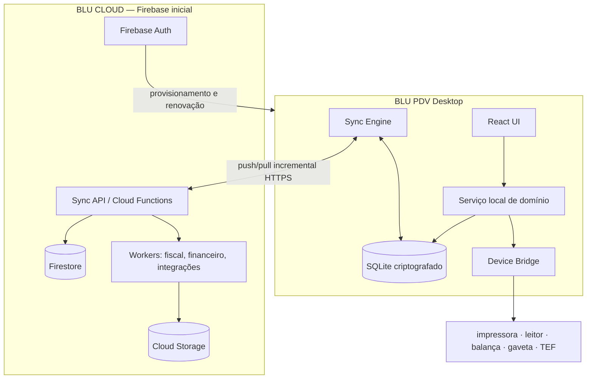
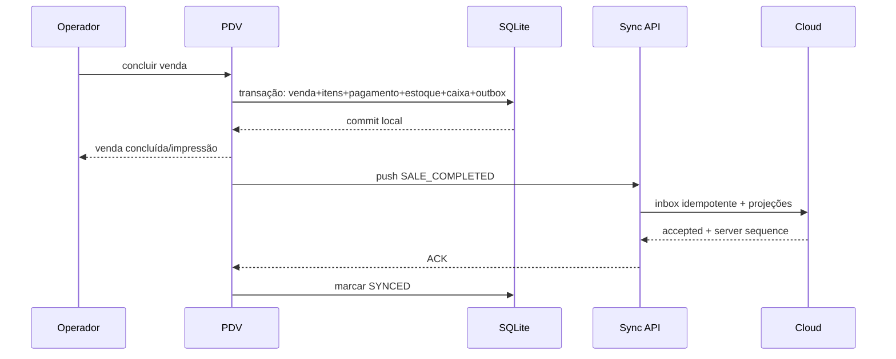
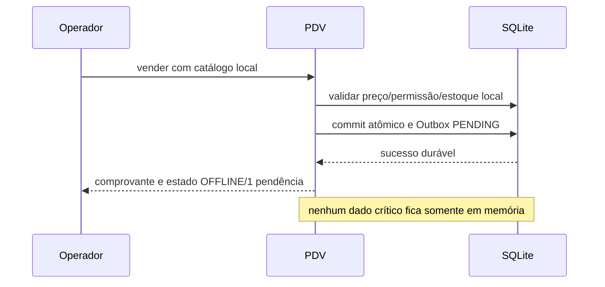

# Arquitetura offline-first do Blu PDV

**Status:** proposta técnica, sem implementação  
**Data da análise:** 31/08/2026  
**Escopo:** PDV, caixa, catálogo, estoque, pagamentos, fiscal, sincronização e operação multiempresa/multiloja.

## 1. Decisão executiva

O Blu deve manter o ERP administrativo como aplicação web/cloud e criar o **Blu PDV como aplicação desktop offline-first**, com:

- interface React/TypeScript compartilhando o design system atual;
- shell **Tauri 2** como primeira escolha;
- **SQLite transacional e criptografado** como banco operacional local;
- serviço local de domínio, impressão e dispositivos, fora do renderer;
- Outbox durável e sincronização incremental com endpoints próprios;
- Firebase Authentication para provisionamento online, mas credencial local segura para sessões offline;
- Firestore e Cloud Functions como cloud inicial, sem exigir migração imediata de backend;
- ledger de estoque e caixa, vendas concluídas imutáveis e estados separados para venda, pagamento, fiscal e sincronização.

O cache offline do Firestore e uma PWA podem melhorar o ERP web, mas **não são a fundação adequada para um PDV profissional**. O próprio Firestore aplica `last write wins` em alterações concorrentes e seu cache contém somente documentos previamente acessados. Isso não resolve carrinho durável, movimentos de estoque, periféricos, numeração fiscal, recuperação após energia ou controle explícito de Outbox.

> Regra arquitetural: primeiro persistir e confirmar localmente; depois sincronizar. Nunca inverter essa ordem.

## 2. Diagnóstico da arquitetura atual

### 2.1 Stack encontrada

| Camada | Estado atual |
|---|---|
| Frontend | React 18, TypeScript, Vite e React Router, executados no navegador |
| Backend | Firebase Cloud Functions, Node.js 22 e TypeScript |
| Dados | Cloud Firestore; Storage para arquivos |
| Autenticação | Firebase Authentication; contexto multiempresa mantido também em `localStorage` |
| Autorização | Firestore Rules e validações nas Functions por `companyId`/membership |
| PDV | Página web no SPA e duas Functions principais para caixa e conclusão da venda |
| Cache | Estado React e `localStorage` para preferências/fallbacks; Firestore sem cache persistente configurado |
| Desktop/PWA | Inexistente; sem Electron, Tauri, service worker, Workbox ou manifesto operacional |
| Banco local | Inexistente; sem SQLite, IndexedDB de domínio, OPFS, RxDB ou PouchDB |

### 2.2 Fluxo atual do PDV

1. A página carrega produtos, clientes, vendas, empresa e caixa pela internet.
2. O carrinho existe apenas em memória React.
3. A abertura/consulta/fechamento de caixa chama `managePointOfSaleRegister`.
4. Ao concluir, o frontend gera uma chave aleatória e chama `completePublicSale`.
5. A Function executa transação Firestore, valida estoque, decrementa `stockQuantity`, grava venda, financeiro, fiscal opcional, e-mail, auditoria e marcador de idempotência.

### 2.3 Pontos já aproveitáveis

- valores financeiros em centavos e quantidades com precisão controlada;
- transação Firestore no processamento cloud da venda;
- marcador de idempotência no backend;
- isolamento por empresa e validação de usuário autenticado;
- separação inicial de venda, lançamento financeiro e documento fiscal;
- vínculo entre operador, caixa, empresa e venda;
- suporte visual a dinheiro, troco, cartão e impressão não fiscal;
- catálogo com SKU, código de barras, preço, NCM, CFOP, tributos e saldo.

### 2.4 Limitações críticas

| Limitação | Consequência |
|---|---|
| Carrinho e venda somente em memória | fechamento do app, travamento ou energia interrompida perde a operação |
| Chave idempotente criada apenas no clique final | não protege uma venda recuperada após reinício |
| Produtos/clientes dependem do carregamento Firestore | um novo carregamento offline pode retornar catálogo vazio |
| Caixa depende de Function | não é possível abrir, movimentar ou fechar caixa sem rede |
| Conclusão depende de Function | não há venda offline |
| Estoque é decremento direto de saldo | conciliação multicanal e auditoria de conflitos ficam frágeis |
| Sem Outbox/inbox/cursor | não há retry durável, push/pull incremental ou diagnóstico |
| Sem `deviceId`, loja e sequência local persistentes | não há rastreabilidade distribuída suficiente |
| Autenticação depende de sessão Firebase | login offline não é garantido |
| Sem banco local transacional | não há atomicidade entre venda, itens, pagamento, caixa, estoque e evento |
| Pagamento pode ser marcado manualmente | risco de confundir registro com autorização externa |
| Fiscal é apenas preparação/preview | não há contingência fiscal implementada nem validada |

### 2.5 O que nunca deve depender da internet durante a venda

- sessão do caixa já provisionado;
- autenticação offline de operador autorizado;
- catálogo, código de barras, preço e promoção sincronizados;
- carrinho, desconto dentro da alçada, cliente mínimo e venda suspensa;
- dinheiro, troco, sangria, suprimento e fechamento local;
- persistência de venda, itens, movimentos locais e Outbox;
- impressão de comprovante não fiscal;
- recuperação após encerramento inesperado.

### 2.6 O que pode ou deve permanecer online

- cadastro administrativo completo, relatórios consolidados e BI;
- mudança global de preço, promoção, permissão e configuração;
- autorização de PIX, boleto, cartão/TEF sem capacidade offline;
- emissão fiscal que exija autorização online;
- e-commerce e marketplaces;
- comunicação, e-mail, conciliação e integrações externas;
- atualização do aplicativo e provisionamento inicial.

## 3. Runtime: PWA x Electron x Tauri x híbrido

| Critério | PWA/Web | Electron | Tauri 2 | Híbrido recomendado |
|---|---|---|---|---|
| Banco transacional | limitado ao browser | SQLite nativo | SQLite nativo | SQLite nativo |
| Impressora/USB/serial | variável e restrito | bom via Node/nativo | bom via Rust/plugins | adaptador nativo por fornecedor |
| TEF/pinpad brasileiro | fraco | amplo ecossistema Node | requer plugin/sidecar | sidecar homologado |
| Proteção contra eviction | não garantida | sim | sim | sim |
| Atualização controlada | service worker pode surpreender | boa | boa | após fechamento de caixa |
| Tamanho/memória | menor | maior | menor | menor no caminho padrão |
| Reuso do React atual | alto | alto | alto | alto |
| Superfície de ataque | browser | maior se mal configurado | capabilities explícitas | API local mínima |

### Recomendação

**Tauri 2 + React + SQLite**, empacotado para Windows inicialmente. O renderer não deve acessar livremente arquivos, banco, impressoras ou segredos: comandos nativos tipados expõem somente operações de domínio.

Adotar um **Device Bridge/sidecar isolado** para TEF, pinpad, balança, gaveta, impressoras e SDKs que exijam DLL/COM/Windows. Se a homologação do fornecedor escolhido oferecer suporte significativamente melhor em Node/Electron, a camada de domínio e sync deve continuar independente do shell, permitindo trocar apenas o adapter. A escolha final do shell precisa ser validada com os fornecedores de TEF e impressão antes da fase de periféricos.

PWA fica como modo administrativo/de contingência limitada, jamais como caixa autoritativo. Electron é fallback técnico, não primeira escolha.

## 4. Comparação do banco local

| Opção | Avaliação |
|---|---|
| SQLite embarcado | **Recomendado.** ACID, WAL, índices, FTS, migrations, backup consistente, ampla maturidade e excelente desempenho local |
| IndexedDB | útil para PWA e caches, mas sujeita ao ciclo de vida/armazenamento do navegador e ergonomia transacional inferior |
| OPFS | promissor para SQLite web, porém não elimina limitações de navegador e periféricos |
| PouchDB | replicação orientada a documentos; conflito e manutenção não combinam bem com o modelo Firestore atual |
| RxDB | recursos amplos, porém aumenta abstração, custo e complexidade antes de validar a operação essencial |
| ElectricSQL/PowerSync | interessantes com PostgreSQL compatível; não se conectam naturalmente ao Firestore atual sem nova plataforma cloud |

Configuração recomendada do SQLite:

- modo WAL, `foreign_keys=ON`, `busy_timeout` e transações curtas;
- armazenamento em diretório privado do aplicativo;
- criptografia do arquivo com SQLCipher ou solução equivalente validada por plataforma;
- chave fora do banco, no DPAPI/Windows Credential Manager ou Keychain;
- coluna monetária inteira em centavos; quantidade em milésimos ou decimal fixo;
- datas em UTC ISO/epoch e `business_date` local explícita;
- migrations versionadas e aplicadas atomicamente.

## 5. Arquitetura proposta



Não é necessário migrar imediatamente para PostgreSQL/Supabase. A Sync API abstrai a persistência cloud; no futuro o ledger de alto volume pode migrar para PostgreSQL sem alterar o protocolo do PDV.

## 6. Modelo de domínio e estados

Uma venda não deve possuir um único `status` sobrecarregado:

```text
sale_status:    DRAFT | OPEN | COMPLETED | CANCELLED | REFUNDED
payment_status: NOT_REQUIRED | PENDING | AUTHORIZED | APPROVED | DECLINED | REVERSED
fiscal_status:  NOT_REQUESTED | PENDING | CONTINGENCY | TRANSMITTING | AUTHORIZED | REJECTED | CANCELLED
sync_status:    LOCAL_ONLY | PENDING | SYNCING | SYNCED | ERROR | CONFLICT
```

Venda `COMPLETED` é imutável. Correções são eventos compensatórios: cancelamento, devolução, estorno ou nota de ajuste. Caixa e estoque também são append-only.

## 7. Identificadores

Usar **UUIDv7** em todas as entidades e eventos criados no PDV. Ele é distribuído, ordenável temporalmente e não depende da nuvem. ULID também funcionaria, mas manter um padrão evita conversões e problemas de normalização.

- ID técnico: UUIDv7 imutável.
- número humano da venda: prefixo loja/terminal + sequência local reservada, apenas para exibição.
- número fiscal: domínio separado, conforme documento, série e regra oficial.
- `event_id`: UUIDv7.
- `idempotency_key`: `tenant:device:event_id` com hash/canonicalização no servidor.

## 8. Esquema local mínimo

| Tabela | Campos/índices essenciais |
|---|---|
| `app_metadata` | `database_version`, schema hash, instalação, última verificação íntegra |
| `devices` | `id`, tenant, store, terminal, status, app/db version, lease, last_sync |
| `companies`/`stores` | configuração mínima, timezone, moeda, parâmetros operacionais |
| `offline_users` | user id, nome, PIN hash, role snapshot, permission version, expiry; nunca senha Firebase |
| `products` | id, version, SKU, nome, unidade, status, tax profile, updated cursor |
| `product_barcodes` | barcode único por tenant/store, product id; índice exato |
| `price_books`/`prices` | produto, tabela, valor, vigência, versão, assinatura/hash |
| `promotions`/`promotion_rules` | vigência, prioridade, condições, ações, versão |
| `customers` | dados mínimos, documento normalizado/hash, versão, consentimento |
| `cash_sessions` | id, register, user, abertura/fechamento, totais projetados, status |
| `cash_movements` | id, session, tipo, valor, motivo, operador, supervisor; append-only |
| `sales` | ids, números, cliente, totais, estados independentes, snapshot de regras |
| `sale_items` | produto/snapshot, quantidade, preço, desconto, tributo e custo conhecidos |
| `payments` | método, valor, status, autorização, provider reference; sem dados de cartão |
| `inventory_movements` | produto, local, tipo, quantidade assinada, origem, sale id, sequence |
| `suspended_sales` | venda/carrinho persistido, versão, expiração e operador |
| `fiscal_jobs` | documento, série/número, XML/hash, estado, tentativas, protocolo |
| `print_jobs` | tipo, payload renderizável, impressora, estado, tentativas |
| `sync_outbox` | evento, entidade, payload, sequence, status, retry, next attempt, erro |
| `sync_inbox` | event id, server sequence, hash, applied_at; bloqueia reaplicação |
| `sync_cursors` | stream, cursor opaco, received/acked at |
| `conflicts` | entidade, versões, política, resolução, responsável |
| `audit_log` | ação, ator, device, entidade, justificativa, correlation id |

Índices obrigatórios: barcode; SKU; nome normalizado/FTS; sale number; status da venda; cash session; produto/local/data de movimento; Outbox por `(status, local_sequence)`; clientes por documento/telefone; fiscal por chave/série/número.

## 9. Outbox sem event sourcing excessivo

Não adotar event sourcing completo na primeira versão. Usar **modelo relacional + ledger append-only + Transactional Outbox**.

Na mesma transação SQLite que conclui uma venda:

1. grava venda e itens;
2. grava pagamento registrado;
3. grava movimento de estoque;
4. grava movimento de caixa;
5. grava jobs fiscal/impressão, se aplicável;
6. insere `SALE_COMPLETED` na Outbox;
7. confirma a transação local;
8. mostra sucesso ao operador.

Eventos agregados por operação de negócio são preferíveis a um evento por alteração visual do carrinho. `SALE_ITEM_ADDED` pode ser auditado, mas a sincronização crítica pode enviar `SALE_COMPLETED` com snapshot completo.

## 10. Protocolo de sincronização

### Endpoints

| Endpoint | Finalidade |
|---|---|
| `POST /v1/pos/devices/register` | provisionar dispositivo e chave pública |
| `POST /v1/pos/sync/bootstrap` | snapshot inicial mínimo, paginado e verificável |
| `POST /v1/pos/sync/push` | enviar lote ordenado de eventos |
| `GET /v1/pos/sync/pull?cursor=...` | obter alterações incrementais por streams |
| `POST /v1/pos/sync/ack` | confirmar aplicação local de lote recebido |
| `POST /v1/pos/sync/reconcile` | solicitar revisão de divergências explícitas |
| `GET /v1/pos/sync/health` | lease, versão mínima, relógio e estado do dispositivo |
| `POST /v1/pos/diagnostics` | diagnóstico sanitizado e assinado |

### PUSH

- lote de até N eventos/tamanho máximo configurável;
- ordem por `device_id + local_sequence`;
- cada evento contém versão do schema, hash, correlation id e idempotency key;
- servidor registra primeiro em `syncEventInbox` com unicidade por evento;
- projeções cloud e side effects ocorrem em transação ou worker idempotente;
- resposta individual: `accepted`, `duplicate`, `rejected`, `conflict`, com server sequence;
- somente `accepted`/`duplicate` confirmado sai da fila ativa; o histórico permanece.

### PULL

- `syncChanges` append-only com sequência monotônica do servidor;
- cursor opaco, nunca apenas relógio do dispositivo;
- streams separados por prioridade: policy, catalog, price, customer, inventory, fiscal;
- upserts versionados e tombstones; sem exclusão física silenciosa;
- aplicação de cada lote em transação SQLite, seguida de ACK.

### Prioridade em background

1. vendas e pagamentos;
2. caixa;
3. fiscal;
4. movimentos de estoque;
5. clientes;
6. dados mestres e integrações.

Retry com exponential backoff, jitter, limite por tentativa e circuit breaker. A tela de venda nunca aguarda a fila.

## 11. Idempotência

- evento: unicidade `tenant_id + event_id`;
- entidade: UUIDv7 criado antes da primeira persistência;
- comando crítico: `idempotency_key` persistida localmente antes do envio;
- servidor mantém inbox/resultado do comando e devolve o mesmo resultado em retry;
- workers usam chaves derivadas: `sale:{saleId}:finance`, `sale:{saleId}:stock`, `sale:{saleId}:mail`;
- e-mail, impressão fiscal, cobrança e lançamento financeiro também são idempotentes;
- hash do payload detecta reutilização indevida da mesma chave com conteúdo diferente.

## 12. Matriz de conflitos

| Entidade | Conflito | Estratégia |
|---|---|---|
| Produto | edição/desativação enquanto PDV offline | cloud é autoridade; versão nova vale para operações futuras; venda preserva snapshot |
| Barcode | mesmo código em produtos diferentes | rejeitar catálogo novo e abrir conflito administrativo |
| Preço | preço muda após sincronização | venda usa preço/versionamento local permitido; servidor não reprecifica venda concluída |
| Promoção | expira offline | validar relógio/assinatura e vigência; venda guarda regra aplicada; fora da política exige supervisor |
| Cliente | edição em dois canais | merge por campo/version vector; documento conflitante vai para revisão |
| Cliente duplicado | criado offline em PDVs diferentes | match por CPF/CNPJ normalizado; vincular/mesclar sem apagar histórico |
| Venda | reenvio/duplicação | event ID e sale ID únicos; servidor retorna resultado anterior |
| Venda concluída | tentativa de alteração | imutável; somente evento compensatório |
| Pagamento | callback e sync simultâneos | referência do provider + idempotência; estado monotônico |
| Estoque | vários canais vendem o mesmo saldo | somar ledger; não sobrescrever; alerta/negativo/reserva conforme política |
| Caixa | movimentos concorrentes | append-only por sessão/dispositivo; sessão possui dono e versão |
| Fiscal | numeração/protocolo | série/intervalo por terminal somente após homologação; nunca last-write-wins |
| Permissão | usuário revogado enquanto offline | lease expira; revogação aplicada na reconexão; ações críticas exigem lease curto |
| Configuração | versão local antiga | cloud wins para futuro; operação histórica guarda snapshot |
| Outbox | mesmo pacote reenviado | inbox única por evento e ACK repetível |

## 13. Estoque offline e omnichannel

O saldo não deve ser campo autoritativo mutável. A autoridade é o **ledger de movimentos**. `inventoryBalances` é projeção reconstruível.

Para pequenos negócios, usar abordagem combinada:

1. saldo e reservas por loja/local;
2. `safety_stock` por produto/canal;
3. cota/limite offline opcional por terminal ou loja;
4. alerta de saldo baixo e negativo;
5. permitir negativo por padrão somente conforme política da empresa/produto;
6. bloquear itens controlados quando ultrapassarem limite offline;
7. e-commerce publica `available = on_hand - reservations - safety_stock - offline_exposure`.

Se três canais consumirem 12 unidades de um saldo 10, todos os movimentos são preservados. O consolidado fica -2 e gera incidente de reposição; nenhuma venda é apagada ou reescrita. Produtos sensíveis podem ter política `HARD_STOP`, mas isso reduz a promessa de continuidade e deve ser configurável.

## 14. Preços e promoções

- sincronizar tabelas e regras versionadas/assinadas;
- armazenar preço, vigência, prioridade, combinação, quantidade e arredondamento;
- venda registra snapshot da regra, preço de lista, desconto e motivo;
- detectar relógio retrocedido comparando wall clock, monotonic clock e hora do último sync;
- promoção expirada não é aplicada; tolerância offline só com política explícita e auditoria;
- descontos fora da alçada exigem PIN local de supervisor e justificativa.

## 15. Pagamentos

| Meio | Operação offline |
|---|---|
| Dinheiro | permitido; aprovado localmente, com troco e caixa transacional |
| Cartão/TEF | somente se o fornecedor retornar autorização offline válida; registrar NSU/código, nunca simular aprovação |
| PIX | em geral requer comunicação; sem confirmação fica `PENDING`, não `APPROVED` |
| Boleto | pode gerar apenas rascunho/pendência se não houver autorização/provider disponível |
| Outros | política explícita; registro não significa autorização |

Nunca armazenar PAN completo ou CVV. Separar `payment_status`, `authorization_status` e `sync_status`. O adapter de pagamento deve declarar capabilities (`online`, `offline_authorization`, `reversal`, `reconciliation`) por provider e versão.

## 16. Fiscal

Venda offline e emissão fiscal offline são processos independentes. A arquitetura deve admitir `sale=COMPLETED` e `fiscal=PENDING_TRANSMISSION`.

O MOC nacional prevê contingência offline para NFC-e, com geração/assinatura do XML, DANFE/QR Code e transmissão posterior dentro do prazo aplicável. Isso **não autoriza assumir que todo estabelecimento/documento/UF pode usar o mesmo fluxo**.

Para o Ceará:

- a transição estadual para NFC-e e a vedação do CF-e/MFE a partir de 01/01/2026 devem ser consideradas;
- confirmar credenciamento, CSC, certificado, série, numeração, software de validação fiscal de pagamentos, regras de contingência e prazo vigente diretamente com SEFAZ-CE e provedor fiscal;
- NF-e, NFS-e e NFC-e possuem contingências diferentes; NFS-e depende também do padrão/provedor municipal/nacional;
- nenhuma série ou faixa deve ser inventada pelo PDV.

Estratégia segura:

1. `FiscalProvider` desacoplado;
2. fila fiscal local distinta da Outbox comercial;
3. XML e hash imutáveis após assinatura;
4. série por terminal ou faixa reservada somente se autorizada oficialmente;
5. máquina de estados com rejeição, duplicidade, inutilização e cancelamento;
6. relógio, certificado e CSC protegidos;
7. transmissão posterior automática e painel de pendências;
8. comprovante não fiscal identificado claramente quando não houver documento fiscal autorizado/contingente.

## 17. Autenticação e permissões offline

### Provisionamento

1. primeiro login sempre online com Firebase Auth;
2. registrar dispositivo e selecionar empresa/loja;
3. emitir lease assinado de dispositivo, usuário e permissões;
4. usuário cria PIN offline; armazenar somente hash Argon2id/salt;
5. chave privada do dispositivo fica no armazenamento seguro do SO.

### Política recomendada

- sessão offline normal: até 72 horas;
- máximo absoluto configurável: 7 dias;
- funções críticas podem exigir lease mais curto ou supervisor;
- após expiração, impedir nova sessão, mas nunca apagar vendas pendentes;
- revogação é aplicada na próxima conexão; risco residual é reduzido por leases curtos;
- troca de senha não revela nem substitui o PIN local sem revalidação;
- permissões são snapshot por empresa/loja e possuem versão/expiração.

Operações críticas (cancelamento, desconto alto, sangria, reabertura) exigem PIN de supervisor, justificativa e auditoria, inclusive offline.

## 18. Segurança local

- banco criptografado; chave no secure storage e vinculada à instalação;
- assinatura do dispositivo e TLS pinning avaliado para Sync API;
- capabilities mínimas do Tauri e CSP restritiva;
- renderer sem acesso arbitrário ao filesystem/shell;
- logs sem CPF completo, credencial, token, PAN ou conteúdo fiscal desnecessário;
- dados de clientes reduzidos ao mínimo operacional;
- backup criptografado e autenticado;
- proteção contra replay por nonce/event ID/sequence;
- bloqueio de downgrade de schema e binário assinado;
- política LGPD de retenção e limpeza somente após confirmação cloud e prazo legal.

## 19. Recuperação, backup e migrations

### Falhas

- carrinho e venda suspensa persistidos em debounce transacional;
- conclusão da venda é uma única transação SQLite;
- WAL recupera commit após energia;
- `PRAGMA integrity_check` no boot e antes de backup crítico;
- disco cheio é detectado antes de abrir caixa e monitorado durante operação;
- evento parcialmente enviado permanece `PENDING` até ACK;
- job fiscal/impressão é retomado de estado durável.

### Backup

- snapshot online do SQLite usando API de backup, nunca cópia bruta com WAL ativo;
- gerações rotativas criptografadas: diário e pré-migration;
- backup não substitui sincronização;
- restauração preserva IDs e Outbox, marca instalação para reconciliação e impede reenvio sem idempotência;
- exportação de diagnóstico exclui segredos.

### Migrations

- `database_version` e `minimum_compatible_sync_version`;
- migrations ordenadas, testadas e transacionais;
- backup e espaço em disco verificados antes de migration;
- se falhar, rollback e inicialização na versão anterior quando compatível;
- nunca atualizar no meio de caixa aberto, salvo patch crítico explicitamente aprovado.

## 20. Atualizações

Estados: `UPDATE_AVAILABLE`, `UPDATE_RECOMMENDED`, `UPDATE_REQUIRED`.

- download em background; pacote assinado e hash verificado;
- instalação preferencial após fechamento e Outbox drenada;
- compatibilidade N/N-1 entre app, schema e Sync API por janela definida;
- atualização obrigatória somente por incompatibilidade de protocolo, segurança ou exigência fiscal;
- rollback do binário sem downgrade destrutivo do banco.

## 21. Multi-PDV, multiloja e dispositivos

Hierarquia:

```text
tenant/company → branch → store → inventory_location → register → device → cash_session
```

Cada PDV possui ID/chave próprios, loja, terminal, versão, cursor, lease e sequência local. Nenhum terminal depende de outro. Um caixa aberto pertence a operador/dispositivo; transferência exige fluxo auditado.

O painel cloud mostra última sincronização, versão, eventos pendentes, erros, status do banco e lease. Ações destrutivas exigem backup e confirmação em duas etapas.

## 22. Tabelas/coleções cloud necessárias

| Coleção | Papel |
|---|---|
| `stores`, `inventoryLocations`, `posDevices` | topologia e provisionamento |
| `posDeviceLeases`, `posPermissionSnapshots` | autenticação/autorização offline assinada |
| `posCashSessions`, `posCashMovements` | ledger de caixa |
| `sales`, `sales/{id}/items`, `sales/{id}/payments` | venda consolidada e componentes |
| `inventoryMovements`, `inventoryBalances` | ledger e projeção de estoque |
| `priceBooks`, `productPrices`, `promotions` | regras versionadas |
| `syncEventInbox`, `syncChanges`, `syncDeviceCursors` | idempotência e incremental sync |
| `syncConflicts`, `syncDiagnostics` | revisão e suporte |
| `fiscalJobs`, `fiscalDocuments`, `fiscalNumberAllocations` | orquestração fiscal |
| `paymentOperations` | autorização/conciliação sem dados sensíveis |
| `auditLogs` | trilha imutável por tenant/device/user |

As coleções atuais podem ser migradas gradualmente. Durante a transição, `pointOfSaleSales` pode ser projeção compatível, mas não deve continuar sendo o único modelo autoritativo.

## 23. Classificação local x cloud

| Dado | Local | Cloud | Sincronização | Autoridade |
|---|---:|---:|---|---|
| Empresa/loja/configuração | cache obrigatório | sim | pull versionado | cloud |
| Dispositivo | sim | sim | bidirecional controlado | cloud/provisionamento |
| Usuários/permissões | snapshot | sim | pull/lease | cloud |
| Produtos/barcodes | sim | sim | pull incremental | cloud |
| Preços/promoções | sim | sim | pull versionado | cloud; snapshot na venda |
| Clientes mínimos | sim | sim | push/pull e merge | cloud com contribuições locais |
| Fornecedores/compras | não necessário no caixa | sim | online inicialmente | cloud |
| Carrinho/venda suspensa | sim | opcional após sync | push | PDV originador |
| Venda concluída/itens | sim | sim | push imutável | evento do PDV |
| Pagamentos | sim | sim | push/callback | provider para autorização; PDV para registro |
| Caixa/movimentos | sim | sim | push append-only | PDV originador |
| Estoque/movimentos | sim | sim | push/pull ledger | movimentos; cloud consolida |
| Saldo projetado | sim | sim | pull/rebuild | derivado |
| Documento fiscal | fila/XML quando permitido | sim | push/provider | autoridade fiscal/protocolo |
| Financeiro derivado | resumo opcional | sim | worker após venda | cloud |
| E-commerce/reservas | exposição mínima | sim | pull | cloud/canal |
| Relatórios/BI | somente operacional | sim | não baixar tudo | cloud |
| Outbox/inbox/cursor | sim | inbox/changes sim | protocolo | cada lado no próprio log |
| Logs/diagnóstico | buffer | sim, sanitizado | push | origem + agregação cloud |
| Segredos/cartão | não | Secret Manager/provider | nunca | provider/secure storage |

## 24. Fluxos

### Venda online



### Venda offline



### Reconexão

```mermaid
sequenceDiagram
  participant P as PDV
  participant L as SQLite
  participant S as Sync API
  P->>S: health + lease
  P->>L: selecionar eventos por sequência/prioridade
  P->>S: push em lotes
  S-->>P: resultados individuais
  P->>L: ACKs; manter erros/conflitos
  P->>S: pull(cursor)
  S-->>P: mudanças incrementais
  P->>L: aplicar lote em transação
  P->>S: ack cursor
```

## 25. Primeira sincronização e reinstalação

### Novo PDV

1. autenticação online e MFA administrativo;
2. registrar device key e selecionar empresa/loja/terminal;
3. criar banco e aplicar migrations;
4. baixar bootstrap paginado com manifest/hash;
5. validar produtos, barcodes, preços, promoções, impostos e usuários;
6. executar teste de escrita, impressão e relógio;
7. emitir lease offline;
8. liberar operação.

### Reinstalação

- bloquear reinstalação se houver Outbox não exportada/sincronizada;
- criar backup autenticado;
- revogar instalação antiga ou realizar transferência assistida;
- nunca reutilizar chave privada nem sequence sem reconciliação;
- bootstrap novo e importação controlada de pendências.

## 26. Performance e observabilidade

Metas iniciais p95 em hardware de referência:

- leitura de barcode até item no carrinho: < 100 ms;
- busca local: < 150 ms;
- persistência de carrinho: < 50 ms;
- conclusão local da venda: < 500 ms sem periférico externo;
- inicialização operacional: < 5 s após banco íntegro.

Logs estruturados: `correlation_id`, tenant, store, device, app/db version, entidade, evento, duração, resultado e código de erro. Métricas: idade/tamanho da Outbox, latência/erros de sync, conflitos, falhas de banco, espaço em disco, rejeições fiscais, pagamentos pendentes e tempo desde último sync. Nunca registrar payload sensível integral.

## 27. Plano de testes

### Unitários e propriedade

- UUID/idempotência, totais, arredondamento, promoções e permissões;
- transições monotônicas de venda/pagamento/fiscal/sync;
- ledger de estoque e caixa;
- migrations e compatibilidade de schema.

### Integração

- commit local + Outbox atômico;
- push duplicado, resposta perdida e retry;
- pull duplicado/fora de ordem/cursor inválido;
- dois dispositivos, conflitos e tombstones;
- provider fiscal/pagamento mockado.

### Caos/offline

- rede cai antes/durante/depois da venda, pagamento e fechamento;
- processo morto em cada passo da transação;
- energia, disco cheio, corrupção/WAL, relógio incorreto;
- 1 hora, 1 dia e 7 dias offline;
- 10.000 vendas/eventos pendentes e rede flapping;
- dois ou mais PDVs offline e e-commerce concorrente;
- atualização/reinstalação com Outbox pendente.

Critério inviolável: toda venda cujo commit local retornou sucesso deve reaparecer após qualquer reinício e produzir no máximo uma venda cloud.

## 28. Roadmap incremental

### Fase 0 — decisões e provas de conceito

- validar Windows/hardware, Tauri, SQLite criptografado e fornecedores TEF/fiscal;
- formalizar protocolo, máquinas de estado e SLOs;
- prova de corte de energia e 10 mil eventos.

### Fase 1 — fundação desktop

- shell, banco, migrations, device, secure storage, catálogo e usuários offline;
- abrir/movimentar/fechar caixa local.

### Fase 2 — venda offline

- carrinho durável, venda suspensa, dinheiro, movimentos, impressão não fiscal e recuperação.

### Fase 3 — sincronização

- bootstrap, push, pull, ACK, inbox/outbox, idempotência, painel e conflitos.

### Fase 4 — estoque e financeiro

- ledger cloud, projeções, reservas, safety stock e lançamentos idempotentes.

### Fase 5 — fiscal

- provider, homologação NFC-e/CE, contingência autorizada, certificado, numeração e transmissão.

### Fase 6 — pagamentos

- TEF/adquirentes, capacidades offline, reversão, conciliação; PIX somente online.

### Fase 7 — omnichannel e resiliência

- canais, reservas, backup/restore, auto-update, caos, observabilidade e suporte remoto.

Rollout por loja piloto, modo paralelo e feature flags. Não substituir o PDV web atual antes de o desktop passar nos testes de recuperação e idempotência.

## 29. Riscos e decisões pendentes

| Risco/decisão | Ação antes de implementar |
|---|---|
| TEF/pinpad e shell desktop | selecionar fornecedor e validar SDK/homologação Windows |
| SQLite criptografado no Tauri | PoC de SQLCipher, backup, migration e recuperação |
| Contingência NFC-e no Ceará | validação formal com SEFAZ-CE, contador e provedor fiscal |
| Série/numeração por terminal | confirmar regra oficial e modelo de credenciamento |
| Software fiscal de pagamentos no CE | confirmar obrigação, integração e cronograma vigente |
| PIX/cartão offline | contratar provider que declare capacidades; não simular autorização |
| Revogação enquanto offline | aprovar duração dos leases e alçadas de risco |
| Estoque negativo | definir política por segmento/produto/canal |
| LGPD/backup local | definir retenção, suporte e resposta a perda/roubo do equipamento |
| Firestore em alto volume | testes de custo/throughput; considerar PostgreSQL para ledger quando métricas justificarem |

## 30. Critérios arquiteturais de aceite

1. Venda não depende da internet quando o método e o fiscal permitem operação local.
2. Nenhum dado crítico existe somente em memória.
3. Commit local precede feedback de sucesso.
4. Reenvio nunca duplica venda, pagamento, estoque, financeiro ou e-mail.
5. Falha de sync nunca apaga Outbox.
6. Venda, pagamento, fiscal e sync possuem estados independentes.
7. Estoque e caixa são ledgers auditáveis.
8. Dois PDVs operam offline sem depender um do outro.
9. Reinício após qualquer falha recupera estado consistente.
10. Fiscal e pagamentos só usam contingências oficialmente suportadas.

## 31. Fontes oficiais consideradas

- [Firebase — acesso a dados offline](https://firebase.google.com/docs/firestore/manage-data/enable-offline): persistência web é desativada por padrão; o cache contém dados previamente acessados e conflitos do mesmo documento usam `last write wins`.
- [Tauri 2 — plugin SQL](https://v2.tauri.app/plugin/sql/): o plugin oficial suporta SQLite e migrations transacionais.
- [Portal Nacional da NF-e — manuais](https://www.nfe.fazenda.gov.br/portal/listaConteudo.aspx?tipoConteudo=ndIjl+iEFdE=): MOC/Anexo IV define a contingência offline da NFC-e e transmissão posterior.
- [SEFAZ-CE — legislação de janeiro de 2025](https://www.sefaz.ce.gov.br/wp-content/uploads/sites/61/2025/02/01_-_Por_dentro_da_legislacao_01_2025.pdf): atos estaduais tratam da transição para NFC-e e vedação do CF-e/MFE a partir de 01/01/2026.

Essas fontes orientam a proposta, mas não substituem homologação fiscal, contratual e contábil antes da emissão em produção.
